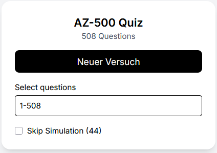

# AZ-500 Quiz App


Interactive quiz application for AZ-500 exam preparation.

---

## 📸 Screenshots

### 🏠 Menu



### ❓ Quiz


## ✨ Features

- Multiple question types  
  - Multiple Choice  
  - Drag & Drop  
  - Yes / No  
  - MultiBox  

- Answer validation with explanations  
- Score tracking  
- Save & load progress (localStorage)
- Review mode  
  - wrong  
  - unanswered  
  - marked  

- Range filtering (e.g. `1-50`)  
- Skip simulation questions  

---

## 🚀 Getting Started

```bash
npm install
npm run dev
```
Open http://localhost:3000 in your browser.

---

📊 Data Source

Questions are loaded dynamically from a Google Sheets CSV export.

---

📜 License

This project is free for personal and educational use.

Commercial use is not permitted without permission.

If you are interested in using this project commercially, please contact me.

---

⚠️ Disclaimer

This project is not affiliated with Microsoft.